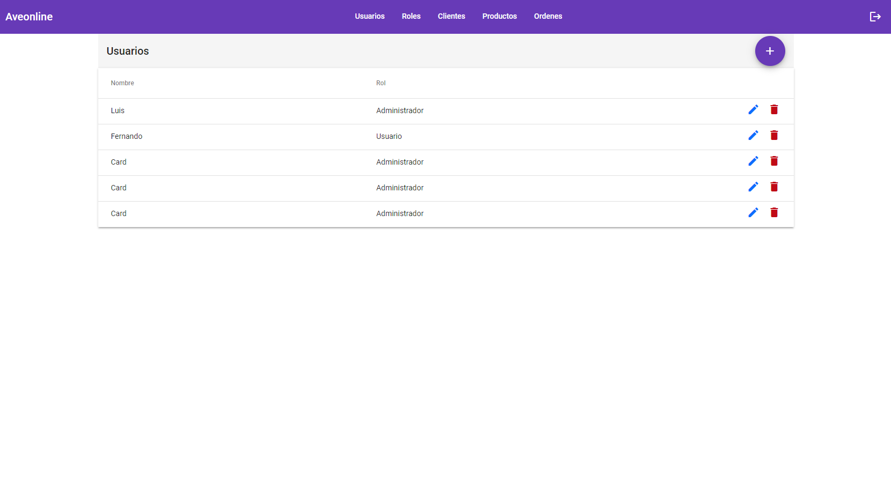

# AveonlineWeb
Esta aplicación está construida con angular, bootstrap y angular material.
Está implementa protección de login bajo el esquema de jwt (https://jwt.io/), esto permite tener seguridad de punta a punta respecto a toda la comunicación con el backend, de igual forma cuenta con protección de rutas para toda la navegación.

Funcionalmente se puede crear, editar, eliminar y consultar usuarios, clientes, roles, productos y órdenes de compra, además de tener inicio de sesión y por ende acceso restringido.

## Requisitos previos

### Programas
1. [x] Node https://nodejs.org/es/

### Versiones
1. [x] Node v14.20.1npm
2. [x] Npm v6.14.17
3. [x] Angular v14.2.12
4. [x] Angular cli v14.2.10

## Instalación
1. [x] Descargar el repositorio de `https://github.com/luissantaospina/aveonline-web.git` con el comando `clone https://github.com/luissantaospina/aveonline-web.git`
2. [x] Moverse a la carpeta del proyecto `cd aveonline-web`
3. [x] Instalar dependencias `npm install`
4. [x] Iniciar aplicación `ng serve`

## Inicio
1. [x] Generalmente se despliega en `http://localhost:4200/` (verificar puesto que esto puede cambiar)
2. [x] Para iniciar sesión se cuenta con 2 usuarios base:

| Nombre            | Email | Clave    | Rol |
-------------------|-------|----------|----|
   | Jhon Doe          | administrador@aveonline.co | password | Administrador |
   | Luis Doe          | usuario@aveonline.co | password | Usuario |

## Previos

